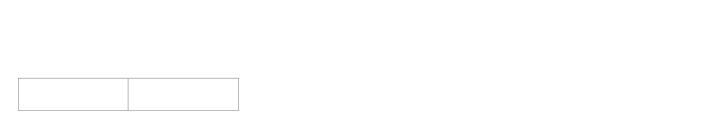

# Basic Algorithms

[C++ achievement GitHub Link](https://github.com/AlaricZeng/FindScorpion.git)

## Sorting

### Merge Sorting

Merge Sorting is an efficient, comparison-based sorting algorithm with O(nlogn) time complexity in either Best, Worst or Average cases. It will take O(2n) = O(n) space: O(n) for the original list and O(n) for extra space. The core idea is dividing and merging. If there are two sorted arrays whose total number of items is n then it will takes O(n) time to merge these two array into a new sorted array. To the original array, we divide it by two until every subset left a single item. In that case, every subset was sorted(just one item). And from bottom to top, each time we merge two nearby arrays. Each time there would be a change in every items' order in original 'big' array. Thus each time it will cost O(n). And since each time we dividing the array by two, we need merge O(logn) times, so totally will cost O(nlogn)

The recurrence would be T(n) = 2T(n/2) + O(n)

Here is an example


### Pseudocode

```pseudocode
Let A[i] i = 1, 2, ..., n; be the original array

defun MergeSort(A, start, end)
{
	if start <= end
	{
		middle = start + (end - start) / 2 
		//Recursive division
		MergeSort(A, start, middle, end)
		MergeSort(A, middle + 1, end)
		//Merge
		Merge(A, start, middle, end)
	}
}

defun Merge(A, start, middle, end)
{
	Let subA1[0,...,P] be a new array that store A[start : middle]
	Let subA2[0,...,Q] be a new array that store A[start + 1 : end]
	Let j = 0; k = 0;

	//Sort the array from start to end position
	for (i = start; i <= end; i++)
	{
		if (subA1[j] < subA2[k])
		{
			A[i] = subA1[j];
			j++;
		}
		else if (subA1[j] >= subA2[k])
		{
			A[i] = subA2[k];
			k++;
		}
	}
}

```

### C++ code to achieve

```C++
/*
File: MergeSort.h
Function: a array as parameter, sort the array from smallest
  		  to largest. The array could be Int, Float, Double,
  		  Char or only type that can judge larger or smaller
Author: AlaricZeng
Date: 03/29/2017
*/

#include <iostream>
using namespace std;

//Merge the two sorted array into one
template <class T>
void Merge(T* arr, int start, int middle, int end)
{
	T* first_arr = new T[middle - start + 1];
	T* second_arr = new T[end - middle];
	int first_q = 0;
	int second_q = 0;

	for (int i = 0; i <= middle - start; i++)
	{
		first_arr[i] = arr[start + i];
	}

	for (int i = 0; i < end - middle; i++)
	{
		second_arr[i] = arr[middle + 1 + i];
	}

	for (int i = start; i <= end; i++)
	{
		if (first_q <= middle - start)
		{
			if ((first_arr[first_q] <= second_arr[second_q]) || second_q > end - middle - 1)
			{
				arr[i] = first_arr[first_q];
				first_q++;
			}
			else
			{
				arr[i] = second_arr[second_q];
				second_q++;
			}
		}
		else
		{
			arr[i] = second_arr[second_q];
			second_q++;
		}
	}
}

//Recruit spliting the array into two [start, middle],
//[middle+1, end]
template <class T> 
void MergeSort(T* arr, int start, int end)
{
	if (start < end)
	{
		int middle = (end + start) / 2;
		MergeSort(arr, start, middle);
		MergeSort(arr, middle + 1, end);
		Merge(arr, start, middle, end);
	}
}

```


### Quick Sorting

Quick Sorting is an efficient, comparison-based sorting algorithm with O(nlogn) time complexity in Best or Average cases. In the worst cases it could cost O(n^2). It will take O(n) space. The core idea is choosing a item in the array as pivot, then traverse the array once and put items that are less or equal to the pivot on the left side and items that are larger or equal to the the pivot on the right side. 



Then consider each side. For each side, select a new pivot and do the same process again. Until to the one that in a side only two elements left, after the same process, the two elements side should be a sortted subarray.

View from the bottom, we know that the left side always no larger than the right side by our processing. And in the bottom, each subarray is a sortted array, thus the total array is sortted.

In the best case, if every time we can choose the medium as pivot, then the recurrence would be T(n) = 2T(n / 2) + O(n), the time complexity should be O(nlogn). However, in the worst case, we may only divide the original array to an array with 1 item and another array with n - 1 items. e.g. If the original array was a descreasing order and we always choose the first item as pivot. The recurrence becomes T(n) = T(n - 1) + O(n). It could cost O(n^2)

Thus, it may largely depend on choosing the 'correct' pivot. In reality, we always choose a random item as pivot.

[back](./)