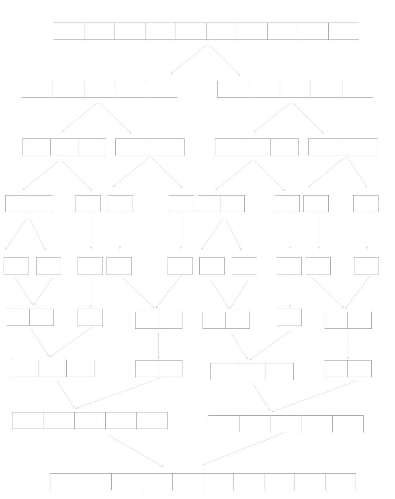

# Basic Algorithms

## Sorting

### Merge Sorting

Merge Sorting is an efficient, comparison-based sorting algorithm with O(nlogn) time complexity in either Best, Worst or Average cases. It will take O(2n) = O(n) space: O(n) for the original list and O(n) for extra space. The core idea is dividing and merging. If there are two sorted arrays whose total number of items is n then it will takes O(n) time to merge these two array into a new sorted array. To the original array, we divide it by two until every subset left a single item. In that case, every subset was sorted(just one item). And from bottom to top, each time we merge two nearby arrays. Each time there would be a change in every items' order in original 'big' array. Thus each time it will cost O(n). And since each time we dividing the array by two, we need merge O(logn) times, so totally will cost O(nlogn)

The recurrence would be T(n) = 2T(n/2) + O(n)

Here is an example

[back](./)