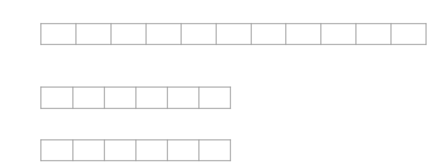
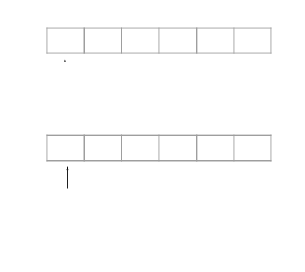

## Find a Scorpion


### Problem Description

A scorpion on n vertices is a graph that has a vertex of degree 1 (the tail), connected to a vertex of degree
2 (the body), connected to a vertex of degree n-2 (the head). The other n-3 vertices (the feet) can be
arbitrarily interconnected.

Give an O(n) algorithm for deciding whether or not an arbitrary graph is a scorpion, assuming that the
graph is represented by an adjacency matrix.


### Algorithm

Let M[i][j] i = 1, 2, ..., n;  j = 1, 2, ..., n; represents the adjacency matrix.

If M[i][j] == 0 represents there is no direct connection between i and j and M[j][i] must be zero.

If M[i][j] == 1 represents there is a direct connection between i and j and M[j][i] must be one.

Pick the first row M[1][j] j = 1, 2, ..., n;

### First we check if the first row is part of the scorpion

We traverse the first row and count the zeros' number, store it in _CZero_. We also count the ones' number and store in _COne_. We also record the first appear zero (except itself M[1][1])as _FZero_ and first appear one as _FOne_.

#### If COne equals to one

Then the first row could be the tail(not necessary, just maybe).
So we check M[_FOne_][j] j = 1, 2, ..., n; to see if the counting of one equals to two(One should be M[_FOne_][1] and other let it be M[_FOne_][_SOne_]). Check if zeros' number in M[_SOne_][j] j = 1, 2, ..., n is n - 2. If it is then we find the scorpion

#### If COne equals to two

Then the first row could be the body(not necessary, just maybe).
So we check if two ones seperatelly represent tail and head by directly going to that two rows and check the ones' number

#### If COne equals to n - 2

Then the first row could be the head(not necessary, just maybe).
So we check if the only zero(except M[1][1]) M[_FZero][j] j = 1, 2, ..., n; represent the tial and it connects to body

### Otherwise

This situation includes those condition that: the first row's one number neither be one, two or n - 2 or the first row isn't tail, head or body after verification

Thus we know that the first row is the foot

We traverse the first row again and store the zero and one value's index into two arrays: AZero, AOne

For instance



Every item in AZero represents either tail, body or foot

Every item in AOne represents either head or foot



We define two pointers PZero, POne that initially point to the head of AZero and AOne. Each time we check if M[AZero[PZero]][AOne[POne]] == 1 which means there is connection between the two items. So the AZero[PZero] couldn't be the tail, we let PZero++. If M[AZero[PZero]][AOne[POne]] == 0, which means there is no connection between the two items, we let POne++.

Since if there is a scorpion, there is a head in AOne that could let all PZero++ except the POne point to the tail. The tail exist in AZero that should let all POne++. Thus when one point points to end, the point in AZero should point to the tail otherwise there isn't scorpion.

### Pseudocode

```pseudocode

M[i][j] represents the adjacency matrix, i,j = 1, 2, ..., n
CZero counts the zero's number, initailly equals to 0
COne counts the one's number, initailly equals to 0
FZero records the first zero appears in the row excepts itself, initailly equals to -1
FOne records the first one appears in the row, initailly equals to -1

for (j = 0; j < n; j++)
{
	if (M[1][j] == 0)
	{
		CZero++;
		if (FZero == -1)
		{
			FZero = j;
		}
	}
	else
	{
		COne++;
		if (FOne == -1)
		{
			FOne = j;
		}
	}
}

if (COne == 1)
{
	Check if M[FOne] is the body
	If it is check if the body connect to an n-2 connections node, which should be a head
}
else if (COne == 2)
{
	Check if it connects to a tail and a head
}
else if (COne == n - 2)
{
	Check if it connects to body and that body connects to an 1 connections node, which should be a tail.
}
else
{
	Maintain two arrays AZero and AOne
	for (j = 0; j < n; j++)
	{
		if (M[1][j] == 0)
		{
			AZero.push_back(j);
		}
		else
		{
			AOne.push_back(j);
		}
	}
}

Let PZero = 0, POne = 0;
while (PZero < AZero.length(); POne < AOne.length())
{
	if (M[AZero[PZero]] == 1)
	{
		pZero++;
	}
	else
	{
		POne++;
	}
}

Check if AZero[PZero] is the tail. If it isn't there is no scorpion.

```

### User interactive program with Javascript

[FindScorpion](assets/source/FindScorpion/index.html)

[back](./)
